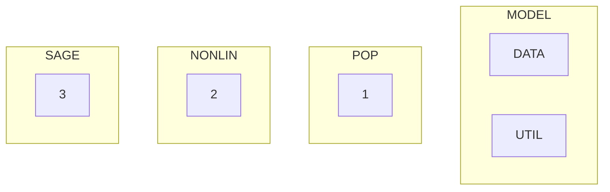

# Mean-Variance-Skewness-Kurtosis (MVSK) optimization 
![[MVSK.png]]

## Introduction 
MVSK.jl is used to compute feasible solution and bounds to the MVSK-problem.
This is done by using techniques from polynomial optimization and non-linear optimization.

**The MVSK-problem:**
$$
\begin{equation}  \tag{0}
\begin{split} 

\max & ~~ f_1(w) := w^T\Phi^{(1)} \\
\min & ~~ f_2(w) := w^T\Phi^{(2)}w \\
\max & ~~ f_3(w) := w^T\Phi^{(3)}(w\otimes w) \\
\min & ~~ f_4(w) := w^T\Phi^{(4)}(w\otimes w \otimes w) \\
s.t. &~~  w \in \Delta^N \\
 \end{split}
 \end{equation}
$$
where $\Delta^N$ is the standard simplex of size $N$ and $\Phi^{(1)},\Phi^{(2)},\Phi^{(3)},\Phi^{(4)}$ are data matrices of appropriate dimensions.

For details of the mathematics see [arXiv paper](url)

---
## How to install
- Download
- Install
- Instantiate
- Test installation

---
## How to use
#### Example 1: using the preloaded data
```

```


#### Example 2:
#### Example 3:

---
## Overview of modules:

$$
\underbrace{\wh{\scr f}_{\SAGE}}_{\text{SAGE bound}} ~~~~\leq~~~~ \underbrace{\wh{\scr f}_{\min}(\omega)}_{\text{NONLIN bound}}
~~~~\leq~~~~ \underbrace{{\scr f}_{\min}(\omega)}_{\text{model}}
~~~~\leq~~~~ \underbrace{\wtl{\scr f}_{\min}(\omega)}_{\text{POP bound}}
~~~~\leq~~~~ \underbrace{\wtl{\scr f}(\omega^{(r)})}_{\text{NONLIN bound}}
$$





---
## To Do list


## Getting started
```Julia
## Running a single model:
Number_of_stocks = 10
Level_of_Hierarchy = 2 # must be higher than 1
k = 3 # 3 for skewnes, 4 for kurtosis
mod     = SDPmodel.get_SDP_model(Number_of_stocks,Level_of_Hierarchy,3)
mod_opt = SDPoptimized.optimize_SDP(mod)


Primal_status    = string(primal_status(mod_opt)) 
Dual_status      = string(dual_status(mod_opt))
objective_value  = JuMP.objective_value(mod_opt)
computation_time = JuMP.solve_time(mod_opt)
```

```Julia
## Running the model for a batch of parameters:
## Skewness
Number_of_stocks_list = [5:15 ...]
Level_of_Hierarchy_list = [2:3 ...] # must be higher than 1
k = 3 # 3 for skewnes, 4 for kurtosis
SDPoptimized.batch_optimize_SDP(Number_of_stocks_list,Level_of_Hierarchy_list,k)
## Kurtosis
Number_of_stocks_list = [5:15 ...]
Level_of_Hierarchy_list = [2:3 ...] # must be higher than 1
k = 4 # 3 for skewnes, 4 for kurtosis
SDPoptimized.batch_optimize_SDP(Number_of_stocks_list,Level_of_Hierarchy_list,k)
```


### How to get your own data.
All you need to do is replace the "...\MVSK\assets\stock_prices.csv" with another CSV that is ove the form

|date|Stock1|Stock2|Stock3|Stock4|...|
|---|---|---|---|---|---|
|1989-12-29|0.117203|0.352438|3.9375|3.48607 |1.752478|2.365775|1.766756|
|1990-01-02|0.123853|0.364733|4.125 |3.660858|1.766686|2.398184|1.766756|
|1990-01-03|0.124684|0.36405 |4.0   |3.660858|1.780897|2.356   |0.173216|
$\vdots$


## Technologies used (libraries & versions, helps recruiters)


### Acknowledgments
This code was written as part of my [POEMA](http://poema-network.eu/) secondment at [NAG](https://www.nag.com/)

This project was funded in part by the Europeans Union's EU Framework Programme for Research and Innovation Horizon 2020 under Marie Skodowska-Curie Actions grant agreement 813211 (POEMA).

I would like to thank:
    1. my promoter Monique Laurent for her guidance and patience throughout the duration of my PhD.
    2. my contacts at NAG: Jan and Shuan for their support and guidance.


